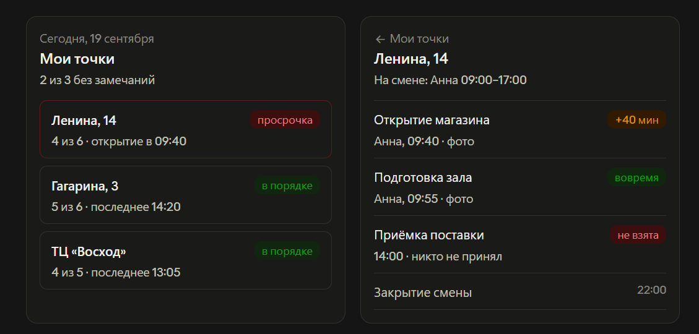
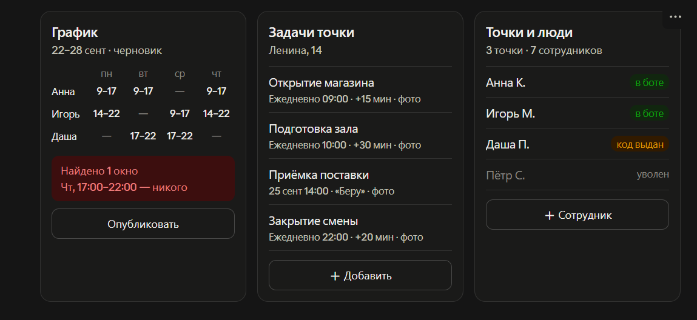
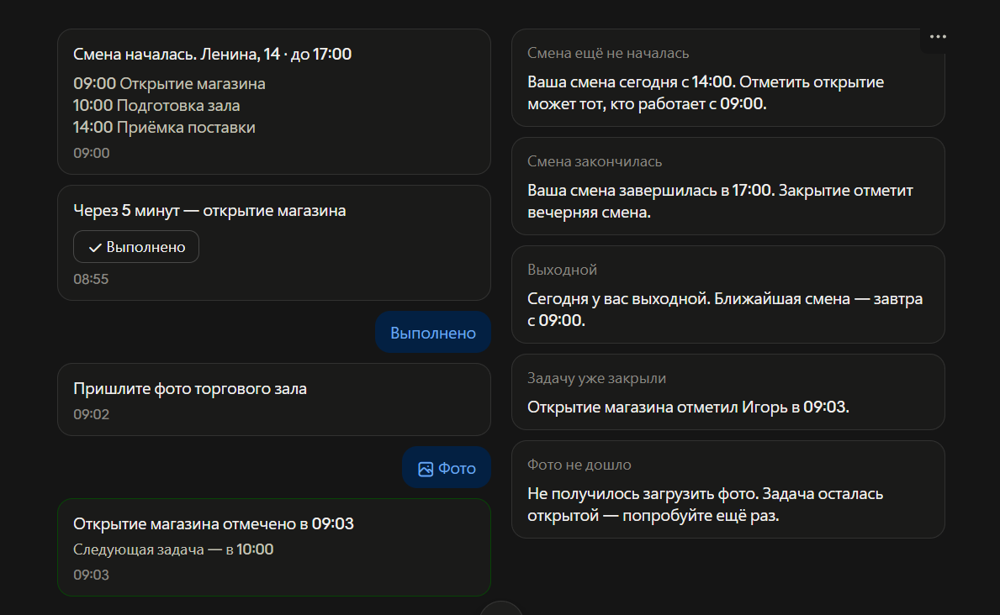
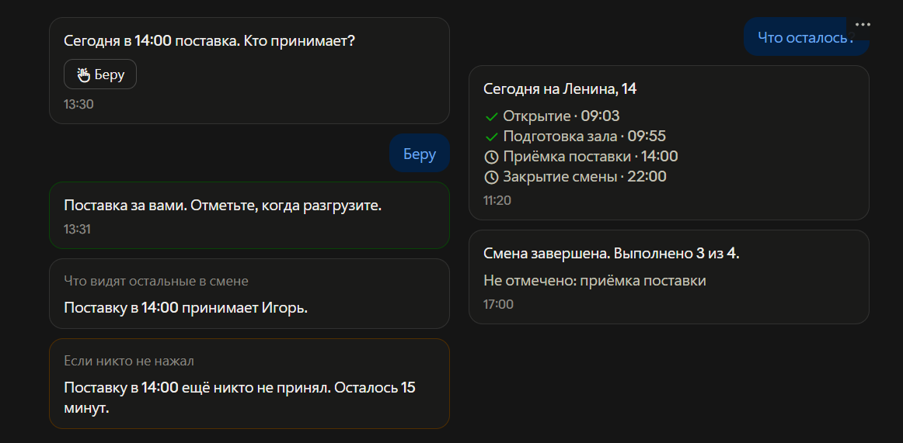
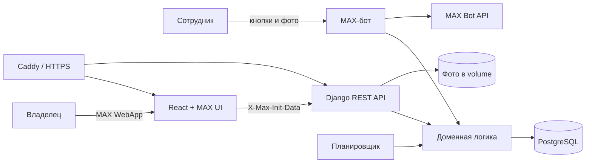

<div align="center">

# Контроль смен

**MAX-бот и мини-приложение, которые сами сообщают владельцу сети о сбоях в работе точек**

[](https://max.ru/t185_hakaton_max_bot)
[](https://www.djangoproject.com/)
[](https://react.dev/)
[](DATA-API.yaml)

[Открыть стенд](https://task-controller.ru) · [Открыть бота в MAX](https://max.ru/t185_hakaton_max_bot) · [Контракт API](openapi.yaml)

Хакатон MAX × Минобрнауки России · трек «Эффективный бизнес» · команда №185

</div>

---

Владелец сети из 3–15 магазинов не должен весь день спрашивать в чатах: «Открылись?»,
«Приняли поставку?», «Закрыли смену?». Система знает график, контролирует задачи и пишет
владельцу только тогда, когда требуется вмешательство.

> **Главный принцип:** в штатном режиме приложение молчит. Каждое уведомление означает
> конкретную проблему: просрочку, незакрытое окно в графике или задачу без ответственного.

## Что умеет продукт

### Для сотрудника — в чате MAX

- привязка к своей точке по одноразовому коду;
- персональная доска смены со списком задач;
- кнопки «Выполнено» и «Беру» прямо в сообщении;
- фото-подтверждение для задач, где оно обязательно;
- два напоминания перед дедлайном;
- понятный отказ, если сотрудник не на смене или задачу ещё рано выполнять;
- обновлённая доска всей активной смене после каждой отметки.

### Для владельца — в мини-приложении

- сводка по всем точкам с проблемными магазинами наверху;
- задачи дня, статусы, исполнитель, время и фото;
- недельный график сотрудников;
- автоматический поиск незакрытых интервалов рабочего дня;
- ежедневные и разовые задачи с собственным окном выполнения;
- управление точками, сотрудниками и кодами приглашения;
- уведомления о просрочке и отдельное сообщение, когда проблему закрыли.

<table>
  <tr>
    <td></td>
    <td></td>
  </tr>
  <tr>
    <td align="center"><b>Сводка и операционный день</b></td>
    <td align="center"><b>График, задачи и сотрудники</b></td>
  </tr>
  <tr>
    <td></td>
    <td></td>
  </tr>
  <tr>
    <td align="center"><b>Начало смены и фотоотчёт</b></td>
    <td align="center"><b>Ответственный и итог смены</b></td>
  </tr>
</table>

## Как проходит смена

1. Владелец создаёт точку, задачи и сотрудников в мини-приложении.
2. Сотрудник отправляет боту одноразовый код и привязывает аккаунт MAX.
3. Владелец заполняет график. Система показывает интервалы, в которые на точке никого нет.
4. В начале смены бот присылает сотруднику актуальную доску задач.
5. Перед сроком бот напоминает о незакрытой задаче. Для поставки или инвентаризации первый
   нажавший «Беру» становится ответственным.
6. Сотрудник нажимает «Выполнено» и, если требуется, отправляет фото.
7. Если срок прошёл, владелец получает уведомление и открывает нужную точку по диплинку.
8. Позднее выполнение закрывает инцидент отдельным уведомлением с именем и временем.

Поставить отметку может только сотрудник активной смены на этой точке. Дополнительно у
каждой задачи есть время `available_from`: закрытие в 22:00 невозможно закрыть в обед.

## Архитектура



| Слой | Технологии | Ответственность |
|---|---|---|
| Мини-приложение | React 19, TypeScript, Vite, MAX UI, MAX Bridge | интерфейс владельца |
| REST API | Django 5.2, Django REST Framework | авторизация MAX и API мини-приложения |
| Бот | Python, MAX Bot API, Long Polling | сотрудник, кнопки, фото и уведомления |
| Домен | Django ORM | права по смене, жизненный цикл задач, покрытие графика |
| Планировщик | Django management command | доски смены, напоминания и эскалации |
| Данные | PostgreSQL, файловый volume | бизнес-данные и фото-подтверждения |
| Деплой | Docker Compose, Caddy | единый HTTPS-адрес приложения и API |

## Быстрый запуск через Docker

Понадобятся Docker и Docker Compose.

```bash
git clone https://github.com/Shipovmax/hackathon_max.git
cd hackathon_max
cp .env.example .env
```

Укажите в `.env` выданный организаторами `BOT_TOKEN`. Для локального HTTP-запуска остальных
значений по умолчанию достаточно.

```bash
docker compose up --build
```

После запуска:

- мини-приложение и API: `http://localhost:8000`;
- проверка сервера: `http://localhost:8000/api/health/`;
- Django Admin: `http://localhost:8000/admin/`.

Создание владельца админки и демонстрационных данных:

```bash
docker compose exec web python manage.py createsuperuser
docker compose exec web python manage.py seed_demo --owner-max-id <MAX_USER_ID>
```

`seed_demo` создаёт сеть, три точки, сотрудников, задачи и график. Команда безопасна при
повторном запуске; флаг `--reset` пересоздаёт демо-набор.

## Запуск мини-приложения без бэкенда

Встроенные mock-данные позволяют показать все экраны без токена MAX и сервера:

```bash
cd frontend
cp .env.example .env
npm ci
npm run dev
```

В `frontend/.env` должно быть `VITE_USE_MOCKS=1`. Приложение откроется на
`http://localhost:5173`.

Для работы с Django установите `VITE_USE_MOCKS=0`. Закрытые API-запросы проходят только из
MAX, потому что сервер проверяет подпись `window.WebApp.initData`.

## Проверка проекта

```bash
# Backend
cd backend
python manage.py check
python manage.py test

# Frontend
cd ../frontend
npm ci
npm run build
```

Для проверки запросов на PostgreSQL:

```bash
docker compose up -d db
docker compose run --rm migrate python manage.py test --noinput
```

## DATA-API 1.0

В корне лежат:

- [`DATA-API.yaml`](DATA-API.yaml) — обязательные HTTP-проверки технической оценки;
- [`openapi.yaml`](openapi.yaml) — OpenAPI 3.1-контракт проверяемых маршрутов.

Все проверки, кроме `/health/`, используют подписанный заголовок `X-Max-Init-Data`.
Значение `${ownerInitData}` не хранится в Git и должно передаваться организаторам через
защищённый канал вместе с доступом к тестовому владельцу, у которого есть хотя бы одна точка.

Проверка официальным валидатором:

```bash
git clone https://gitverse.ru/stasnorman/example-data-api.git ../example-data-api
python3 -m venv ../example-data-api/.venv
../example-data-api/.venv/bin/pip install -r ../example-data-api/requirements.txt
../example-data-api/.venv/bin/python ../example-data-api/validate_data_api.py \
  DATA-API.yaml \
  --schema ../example-data-api/Example/DATA-API.schema.json \
  --openapi openapi.yaml
```

Ожидаемый результат:

```text
ПОДТВЕРЖДЕНИЕ файл DATA-API.yaml соответствует версии схемы 1.0
```

## Основные API-маршруты

Авторизация владельца: заголовок `X-Max-Init-Data` со значением параметров запуска MAX.
Чужие точки и сотрудники скрываются на уровне API.

| Метод и путь | Назначение |
|---|---|
| `GET /api/health/` | публичная проверка доступности |
| `GET /api/me/` | владелец и его сеть |
| `GET /api/dashboard/` | сводка всех точек за день |
| `GET/POST /api/stores/` | точки и сотрудники |
| `GET /api/stores/{id}/day/` | задачи, смена, отметки и фото за день |
| `GET/POST /api/stores/{id}/task-templates/` | ежедневные и разовые задачи |
| `PATCH/DELETE /api/task-templates/{id}/` | изменение или деактивация задачи |
| `GET/PUT /api/stores/{id}/schedule/` | недельный график |
| `POST /api/stores/{id}/schedule/coverage/` | проверка покрытия без сохранения |
| `POST /api/stores/{id}/schedule/publish/` | публикация графика |
| `GET /api/completions/{id}/photo/` | защищённое фото отметки |

Подробности проверяемой части контракта находятся в [`openapi.yaml`](openapi.yaml).

## Переменные окружения

Полный список с комментариями находится в [`.env.example`](.env.example). Ключевые значения:

| Переменная | Назначение |
|---|---|
| `BOT_TOKEN` | секретный токен бота MAX |
| `BOT_USERNAME` | ник бота для диплинков |
| `PUBLIC_BASE_URL` | публичный HTTPS-адрес мини-приложения |
| `DJANGO_SECRET_KEY` | секрет Django для production |
| `POSTGRES_*` | подключение к PostgreSQL |
| `INIT_DATA_MAX_AGE_SECONDS` | срок действия подписи запуска MAX |
| `REMINDER_*` | интервалы двух напоминаний |
| `PHOTO_WAIT_MINUTES` | срок ожидания фото |
| `SHIFT_BOUNDARY_TOLERANCE_MINUTES` | допуск на границах смены |

Секреты хранятся только в локальном `.env`, который исключён из Git.

## Структура репозитория

```text
backend/
  apps/core/     модели и доменная логика
  apps/api/      REST API мини-приложения
  apps/bot/      MAX-бот и планировщик
frontend/        React-мини-приложение владельца
deploy/          Caddy и скрипты подготовки сервера
docs/mockups/    макеты основных сценариев
DATA-API.yaml    сценарий автоматической проверки API
openapi.yaml     контракт проверяемых маршрутов
compose.yaml     локальный и production-запуск
```

## Безопасность и данные

- Сервер проверяет HMAC-подпись и срок действия `window.WebApp.initData`.
- Мини-приложение доступно только владельцу сети.
- Все объекты API ограничиваются сетью текущего владельца.
- Фото выдаются через защищённый API, а не прямой публичной ссылкой.
- Одноразовый код приглашения инвалидируется после привязки сотрудника.
- Удаление задач и сотрудников сохраняет историю уже выполненных смен.
- Токены, ключи и персональные тестовые данные не коммитятся.

## Границы MVP

В MVP сознательно нет автоматического составления графика, кадрового учёта, расчёта зарплаты,
геолокации и интеграции с кассовыми системами. Продукт решает одну задачу: показывает, что
сейчас происходит в точках, и сообщает о сбое до того, как он станет проблемой для бизнеса.

---

<div align="center">

**Владелец не спрашивает — система сообщает.**

</div>
